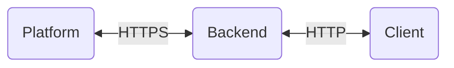

# EXM Backend Assignment

## Architecture


## Scenario
We want to simulate a hardware device (`client`) that provisions itself and sends weather data to an IoT `platform`. 
In order to hide the internals of this platform and provide a friendlier API we introduce an intermediate HTTP server
(`backend`) with the following basic capabilities:
- Create/delete a device 
- Upload/download telemetry data

## Requirements
- [Docker 26.1.1, build 4cf5afa](https://www.docker.com/)

## Usage
- Clone this repository:
```
git clone https://github.com/thanospan/exm-playground.git
cd exm-playground
```

- Switch to the `dev` branch:
```
git checkout dev
```

- Update env variables:
```
cp backend/config/.env.example backend/config/.env
nano backend/config/.env

cp client/config/.env.example client/config/.env
nano client/config/.env
```

- Run:
```
docker compose up
```

## Backend
All URIs are relative to *http://localhost:3004*

| HTTP Method | Endpoint |  Parameters |
| ----------- | -------- | ---------- |
| POST | /devices | query: accessToken (optional - default: random generated)<br> body: name, type |
| POST | /devices/:entityId/telemetry | params: entityId<br> body: Single measurement or array of measurements |
| GET | /devices/:entityId/telemetry | params: entityId<br> query:<br> keys (default: temperature,humidity,pressure,wind_speed,wind_gust,wind_direction)<br> startTs (default: 1648760400000 - Friday, April 1, 2022 12:00:00 AM)<br> endTs (default: 1649970000000 - Friday, April 15, 2022 12:00:00 AM)<br> agg (MIN, MAX, AVG, SUM, COUNT, NONE - default: SUM)<br> interval (default: 3600000 ms - 1 hour)<br> intervalType (MILLISECONDS, WEEK, WEEK_ISO, MONTH, QUARTER - default: MILLISECONDS)<br> limit (default: 336) |
| DELETE | /devices/:entityId |  |

A Postman collection is provided in the `postman` directory.

## Client
- The `client` creates a new device by sending a `POST` request to the `/devices` endpoint of the `backend`.
- The `client` reads the data from the csv file and sends 225 measurements (16000 ms interval between measurements in data.csv, 3600000 ms in 1 hour, 3600000 / 16000 = 225) to the `backend` by sending `POST` requests to the `/devices/:entityId/telemetry` endpoint.
- The aggregated data (sum per hour) can be retrieved by sending a `GET` request to the `/devices/:entityId/telemetry` endpoint of the `backend`. Charts from a ThingsBoard dashboard can be found in the `charts` directory.
