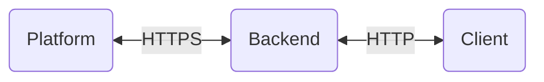

# Backend Assignment
A small - and hopefully - fun exercise

## Scenario
We want to simulate a hardware device (`client`) that provisions itself and sends weather data to an IoT `platform`. 
In order to hide the internals of this platform and provide a friendlier API we introduce an intermediate HTTP server
(`backend`) with the following basic capabilities:
- Create/delete a device 
- Upload/download telemetry data

##Assignment
Fork this Github repository, proceed with the development and ping us when you're ready!
Happy coding :)

### You are provided with:
- Repository with detailed explanation of the test and a dataset in CSV format
- Thingsboard server url 
- Tenant admin credentials 

### You need to deliver:
1. `backend` 

A node express app with REST endpoints that will interact with a Thinsgboard server and respond appropriately to `client`:
  - Endpoint for device creation
  - Endpoint for device deletion
  - Endpoint for uploading telemetry
  - Endpoint for downloading telemetry: returns the aggregated (SUM per hour) telemetry data from a specific device

2. `client`

A node app that makes use of the `backend` API that you created by:
  - creating a new device 
  - uploading data from the CSV file (data.csv) as telemetry to that device (use as many requests as you deem fit)

### Requirements
  - All interactions between `backend` and the `platform` should be done via the ***HTTP*** API
  - Both apps should be containerized and wrapped in ***docker-compose*** script for easy deployment
  - All code should be available in the repository
